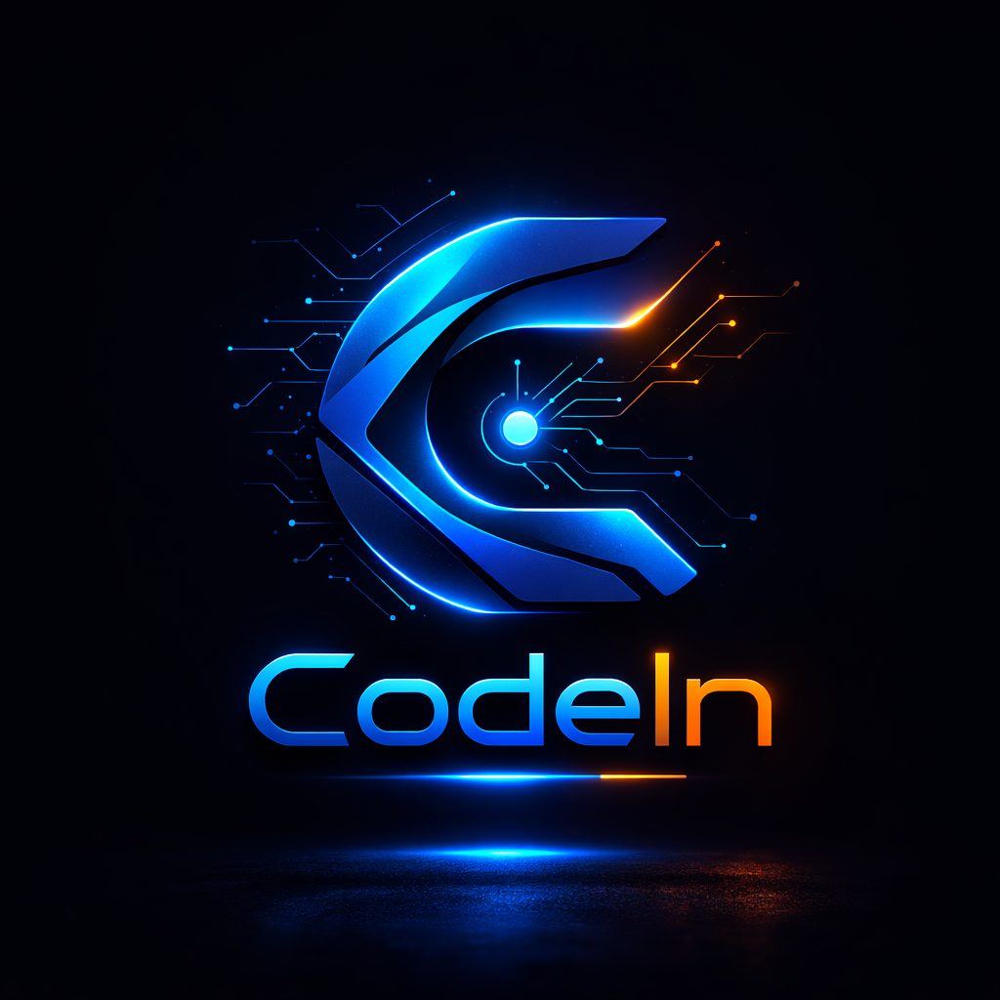

<div align="center">



# CodIn

### Multilingual AI Coding Platform

[](https://github.com/inbharat-ai/codein.pro)
[](https://nodejs.org/)
[](https://www.typescriptlang.org/)
[](LICENSE)

[](https://github.com/inbharat-ai/codein.pro)
[](LICENSE)
[](CONTRIBUTING.md)

---

**CodIn is a world-class AI coding platform built to combine Cursor/Copilot-class workflows with multilingual intelligence, local-first control, and practical low-cost AI execution.**

_Vibe coding · Autonomous task flows · Repo-aware development · Natural-language commands in Hindi, Hinglish, and 20+ languages — normalized into English internally for accurate AI execution._

**By Bharat, for the world.** 🇮🇳

<br/>

[⬇️ Download](https://github.com/inbharat-ai/codein.pro/releases) · [📖 Docs](./docs/) · [🐛 Issues](https://github.com/inbharat-ai/codein.pro/issues) · [💬 Discussions](https://github.com/inbharat-ai/codein.pro/discussions)

</div>

<br/>

---

<br/>

## 🎯 What Makes CodIn Different

> **CodIn is not a code editor with AI attached. It is designed as a full AI coding system** — local-first execution, agent orchestration, multilingual understanding, autonomous workflows, and visible control over what the AI is doing.

Built to reach the same trust, speed, and usability standard people expect from **Cursor** and **GitHub Copilot**, while adding strengths that matter for Bharat and global developers alike.

<table>
<tr>
<td width="50%">

### 🎨 Vibe Coding, Not Just Autocomplete

Not limited to single-line suggestions. Describe what you want in natural language and CodIn helps **plan, generate, refactor, validate, and improve code** across the project.

- ✅ Feature generation
- ✅ Repo-aware edits
- ✅ Multi-step coding workflows
- ✅ Guided implementation
- ✅ Autonomous coding pipelines
- ✅ Multi-file changes

</td>
<td width="50%">

### 🌍 Multilingual Command Understanding

Type or speak in **Hindi, Hinglish, Bengali-English mix, Assamese-English mix**, and other multilingual patterns. CodIn normalizes input into an internal English task format for precise AI execution.

- 💬 _"login page bana do with Google auth"_
- 💬 _"is repo ka backend improve karo"_
- 💬 _"dashboard ko aur clean banao"_

→ Interpreted and converted into structured coding intent.

</td>
</tr>
<tr>
<td width="50%">

### 💰 Powerful AI, Practical Cost

Core AI workflows run without forcing expensive usage patterns. **Local-first execution, intelligent routing**, and built-in agent capabilities keep the tool accessible and cost-efficient.

> _CodIn aims to feel powerful like premium tools, while staying much more practical and accessible._

</td>
<td width="50%">

### 🔒 Local-First Control

Your workflows stay in **your environment** — not in a remote black-box editor. Better visibility, more control, stronger foundation for **privacy-conscious and enterprise-friendly** development.

</td>
</tr>
<tr>
<td colspan="2" align="center">

### 🌐 Built for Language Expansion

The multilingual layer is extensible — support grows across **more Indian and global languages** over time.
The vision: **make AI coding usable for people who do not naturally think only in English.**

</td>
</tr>
</table>

<br/>

---

<br/>

## 🧠 Multilingual Intelligence — Live Demo

<div align="center">

> CodIn detects your language, preserves technical terms, normalizes colloquial phrasing,
> and converts instructions into execution-ready English internally.

</div>

<table>
<tr>
<th align="center">🗣️ What you say (Hinglish)</th>
<th align="center">⚙️ What CodIn understands</th>
</tr>
<tr>
<td align="center">

**"Mere liye ek dashboard banao jisme login, profile aur settings ho."**

</td>
<td align="center">

**"Create a dashboard with authentication, user profile, and settings pages."**

</td>
</tr>
<tr>
<td align="center">

_"login page bana do with Google auth"_

</td>
<td align="center">

_"Create a login page with Google OAuth integration"_

</td>
</tr>
<tr>
<td align="center">

_"is repo ka backend improve karo"_

</td>
<td align="center">

_"Improve the backend of this repository"_

</td>
</tr>
<tr>
<td align="center">

_"dashboard ko aur clean banao"_

</td>
<td align="center">

_"Clean up and improve the dashboard UI"_

</td>
</tr>
</table>

<br/>

**How it works:**

```
User input (any language) → Detect language → Preserve technical terms → Normalize phrasing → English task → AI execution
```

**Supported:** Hindi · Tamil · Bengali · Telugu · Marathi · Gujarati · Kannada · Malayalam · Punjabi · Assamese · Odia · Urdu · Sanskrit — plus mixed-language patterns (Hinglish, Benglish, etc.)

<br/>

---

<br/>

## 🎨 Vibe Coding Experience

> The developer focuses on **intent, direction, and quality**. CodIn handles the heavy lifting across implementation steps.

<table>
<tr>
<td align="center" width="25%">

**💡 Describe**
<br/>the feature

</td>
<td align="center" width="25%">

**🔨 Full Stack**
<br/>frontend + backend flow

</td>
<td align="center" width="25%">

**🔄 Refactor**
<br/>improve existing code

</td>
<td align="center" width="25%">

**🎨 UI/UX**
<br/>improve design

</td>
</tr>
<tr>
<td align="center">

**🐛 Fix Bugs**
<br/>find and resolve issues

</td>
<td align="center">

**📄 Generate**
<br/>missing files

</td>
<td align="center">

**✅ Validate**
<br/>test and iterate

</td>
<td align="center">

**📦 Multi-File**
<br/>cross-project changes

</td>
</tr>
</table>

> _The long-term goal: CodIn feels like a serious AI engineering partner, not just a code suggestion box._

<br/>

---

<br/>

## ⚡ Why This Matters

<table>
<tr>
<th align="center">❌ Most tools assume</th>
<th align="center">✅ CodIn delivers</th>
</tr>
<tr>
<td>The user thinks in English</td>
<td><b>Natural multilingual interaction</b></td>
</tr>
<tr>
<td>The user wants only inline completion</td>
<td><b>Stronger repo-aware workflows</b></td>
</tr>
<tr>
<td>The AI is a helper, not a workflow engine</td>
<td><b>Affordable, practical AI-assisted development</b></td>
</tr>
<tr>
<td>Powerful AI must always be expensive</td>
<td><b>Local-first control + future-ready expansion</b></td>
</tr>
</table>

<br/>

---

<br/>

## 🏆 CodIn vs. Paid Tools

<div align="center">

| Feature                             |   **CodIn**    | Cursor ($20/mo) | Copilot ($10/mo) | Windsurf ($15/mo) |
| :---------------------------------- | :------------: | :-------------: | :--------------: | :---------------: |
| AI Code Completion                  |       ✅       |       ✅        |        ✅        |        ✅         |
| AI Chat & Agent Mode                |       ✅       |       ✅        |        ✅        |        ✅         |
| **100% Free & Open Source**         |     **✅**     |       ❌        |        ❌        |        ❌         |
| **Runs Fully Offline (Local AI)**   |     **✅**     |       ❌        |        ❌        |        ❌         |
| **20+ Indian Language Support**     |     **✅**     |       ❌        |        ❌        |        ❌         |
| **Voice Coding (Indian Languages)** |     **✅**     |       ❌        |        ❌        |        ❌         |
| **Sovereign / Air-Gapped Mode**     |     **✅**     |       ❌        |        ❌        |        ❌         |
| MCP Tool Protocol                   |       ✅       |       ✅        |        ~         |        ✅         |
| Built-in Web Research               |       ✅       |        ~        |        ❌        |        ✅         |
| **Zero Telemetry / No Tracking**    |     **✅**     |       ❌        |        ❌        |        ❌         |
| Local Compute Engine                |       ✅       |       ❌        |        ❌        |        ❌         |
| Local Media Generation              |       ✅       |       ❌        |        ❌        |        ❌         |
| **Price**                           | **$0 forever** |     $20/mo      |      $10/mo      |      $15/mo       |

</div>

<table>
<tr>
<td align="center" width="33%">

**💰 Save $120–$480/year**

Cursor costs $240/yr, Copilot $120/yr. CodIn is free forever — no usage limits, no premium tiers, no locked features.

</td>
<td align="center" width="33%">

**🔐 Your Code Stays Yours**

Paid tools send code to their servers. CodIn's local AI means proprietary code, API keys, and secrets never leave your machine.

</td>
<td align="center" width="33%">

**🇮🇳 Built for Bharat**

No other AI code editor supports 20+ Indian languages for voice, chat, and comments. CodIn thinks in your mother tongue.

</td>
</tr>
</table>

<br/>

---

<br/>

## 🚀 Production Features

<table>
<tr><td>

| Category                 | Capability                                                                                                   |
| :----------------------- | :----------------------------------------------------------------------------------------------------------- |
| 🌍 **Multilingual**      | Code, chat, voice in Hindi, Tamil, Bengali, Telugu, Marathi, Gujarati, Kannada, Malayalam, Punjabi, and more |
| 🎙️ **Voice Coding**      | Real-time STT/TTS, browser and backend, 14+ languages                                                        |
| ⚡ **Vibe Coding**       | Live agent orchestration, session isolation, compute pipeline, pause/resume/cancel                           |
| 🔗 **Live Bridge**       | Client ↔ Agent HTTP + SSE for task streaming, permission loops, real-time feedback                          |
| 🧮 **Compute Routing**   | Local, swarm, GPU, and external API escalation with budget guardrails                                        |
| 🔒 **Session Isolation** | Safe multi-user and parallel workflows, sandboxed workspaces, policy enforcement                             |
| 🛡️ **Reliability**       | Circuit breaker, retry/backoff, timeout, infinite-loop detection, audit logging                              |
| 📊 **Observability**     | Health, compute, sessions, agents, pipeline, metrics, audit logs                                             |
| 🔍 **Research API**      | Serper-compatible, no API keys, web/code/docs/bug search                                                     |
| 🔌 **MCP Tools**         | Connect to GitHub, Slack, Jira, DBs, Docker, Kubernetes — autonomous tool use                                |
| 📋 **Compute Pipeline**  | Goal → plan → execute → artifact, sandbox isolation, multilingual I/O                                        |
| 🤖 **Offline AI**        | Bundled llama.cpp, no API keys, no cloud bills, code never leaves your machine                               |
| ✨ **Autocomplete**      | Context-aware ghost-text, project-aware, lightning fast                                                      |
| 💬 **AI Chat & Edit**    | Conversational, @-mentions for files and symbols, test generation                                            |
| 🕵️ **100% Private**      | No telemetry, no tracking, no cloud dependency                                                               |
| 💻 **Cross-Platform**    | Windows, macOS (Intel + Apple Silicon), Linux                                                                |

</td></tr>
</table>

**Unified capabilities:**

- No-key research endpoint: `POST /api/research/serper`
- Unified local/swarm/GPU routing
- API-driven autonomous coding pipeline: idea → spec → code → test → review → delivery
- Tool-execution safety built into agent behavior

<br/>

---

<br/>

## 🏗️ Architecture

```
┌──────────────────────────────────────────────────────────┐
│                     CodIn Clients                        │
│  • Desktop shell / Electron app                          │
│  • IDE integration adapter (packages/extension)          │
│  • GUI workflow panels (gui/)                            │
└─────────────────────────┬────────────────────────────────┘
                          │ HTTP + SSE
                          ▼
┌──────────────────────────────────────────────────────────┐
│              CodIn Agent Runtime (:43120)                 │
│  Auth │ Runtime │ i18n │ Research │ MCP │ Run │ Compute  │
│  Swarm │ Routing │ Sessions │ Status │ Pipeline │ Vibe   │
└─────────────────────────┬────────────────────────────────┘
                          ▼
┌──────────────────────────────────────────────────────────┐
│              Execution & Orchestration                    │
│  • MAS agents and topologies                             │
│  • Compute selector (local/swarm/GPU)                    │
│  • Session manager (isolation + TTL)                     │
│  • Reliability engine (retry/timeout/circuit breaker)    │
│  • Model runtime + external providers                    │
└──────────────────────────────────────────────────────────┘
```

**Route surface:** `auth` · `models` · `runtime` · `i18n` · `research` · `mcp` · `agent-tasks` · `run` · `permissions` · `performance` · `external-providers` · `intelligence` · `compute` · `swarm` · `vibe` · `routing` · `sessions` · `status` · `pipeline`

<br/>

---

<br/>

## 🔄 End-to-End Flow

```
Client action
  → POST /swarm/tasks
  → Agent orchestrates (classify → route → execute)
  → SSE stream from GET /swarm/events
  → Client submits permission decisions (if needed)
  → Results from GET /swarm/tasks/:taskId/results
```

**Validation endpoints:** `GET /api/health` · `GET /status` · `GET /status/compute` · `GET /status/sessions` · `GET /status/agents` · `GET /metrics`

<br/>

---

<br/>

## ⚡ Quick Start

### Prerequisites

- **Node.js** `>=20.19`
- **Python** `>=3.8` (for i18n components)

### 1️⃣ Run Agent Runtime

```bash
cd packages/agent
npm install
npm start
```

```
✅ CodIn Agent listening on http://127.0.0.1:43120
✅ All subsystems loaded
```

### 2️⃣ Verify Health

```bash
curl http://127.0.0.1:43120/api/health
curl http://127.0.0.1:43120/status
curl http://127.0.0.1:43120/status/compute
```

### 3️⃣ Choose Your Interface

| Interface        | Path                                                           |
| :--------------- | :------------------------------------------------------------- |
| 🖥️ Desktop       | [`electron-app/README.md`](electron-app/README.md)             |
| 🧩 IDE Extension | [`packages/extension/README.md`](packages/extension/README.md) |
| 🎨 GUI Panels    | [`gui/README.md`](gui/README.md)                               |

<br/>

---

<br/>

## 🔍 Research API (Serper-Compatible)

```bash
curl -X POST http://127.0.0.1:43120/api/research/serper \
  -H "Content-Type: application/json" \
  -d '{"query":"React hooks tutorial","num_results":5}'
```

| Endpoint                                       | Purpose              |
| :--------------------------------------------- | :------------------- |
| `POST /api/research/serper`                    | General web search   |
| `POST /api/research/web-search`                | Web search           |
| `POST /api/research/fetch-url`                 | Fetch URL content    |
| `POST /api/research/code-documentation-search` | Documentation search |
| `POST /api/research/code-example-search`       | Code examples        |
| `POST /api/research/bug-solution-search`       | Bug solutions        |

<br/>

---

<br/>

## 📁 Repository Map

| Directory            | Purpose                                 |
| :------------------- | :-------------------------------------- |
| `packages/agent`     | Core runtime and orchestration server   |
| `packages/extension` | IDE integration adapter                 |
| `gui`                | Workflow UI panels and chat surfaces    |
| `electron-app`       | Standalone CodIn desktop shell          |
| `core`               | Shared engine/runtime modules           |
| `landing`            | Public website and distribution surface |

<br/>

---

<br/>

## 🔒 Security & Reliability

- 🚫 Telemetry-off local-first default
- 🔐 Permission-gated destructive operations
- 📝 Structured audit logging
- ⏱️ Timeout and retry protection in critical agent loops
- ⚡ Circuit-breaker backed LLM/tool execution paths

**Detailed docs:** [`SECURITY.md`](SECURITY.md) · [`SECURITY_AND_INTEGRATION.md`](SECURITY_AND_INTEGRATION.md) · [`ARCHITECTURE.md`](ARCHITECTURE.md) · [`BACKEND_API_REFERENCE.md`](BACKEND_API_REFERENCE.md)

<br/>

---

<br/>

## 🧪 Testing

```bash
# All tests
npm test

# Agent-only tests
cd packages/agent
npm test
```

<br/>

---

<br/>

## 🤝 Contributing

- Read [`CONTRIBUTING.md`](CONTRIBUTING.md)
- Follow [`DEVELOPMENT.md`](DEVELOPMENT.md)
- Keep claims in docs aligned with implemented routes and runtime behavior

<br/>

---

<br/>

## 📜 License

Apache 2.0 — see [`LICENSE`](LICENSE)

<br/>

---

<div align="center">

<br/>

**Made with ❤️ by Bharat, for the world** 🇮🇳

<br/>

[](https://github.com/inbharat-ai/codein.pro)
[](https://github.com/inbharat-ai/codein.pro/issues)
[](./docs/)

<sub>CodIn is open-source software licensed under Apache 2.0. Free forever.</sub>

</div>

Key validation endpoints:

- `GET /api/health`
- `GET /status`
- `GET /status/compute`
- `GET /status/sessions`
- `GET /status/agents`
- `GET /metrics`

## Quick Start

### Prerequisites

- Node.js `>=20.19`
- Python `>=3.8` (for i18n components)

### 1) Run Agent Runtime

```bash
cd packages/agent
npm install
npm start
```

Expected:

```text
CodIn Agent listening on http://127.0.0.1:43120
All subsystems loaded
```

### 2) Verify Runtime Health

```bash
curl http://127.0.0.1:43120/api/health
curl http://127.0.0.1:43120/status
curl http://127.0.0.1:43120/status/compute
```

### 3) Run Client Layer

Choose your interface path:

- Desktop path: see `electron-app/README.md`
- IDE integration path: see `packages/extension/README.md`
- GUI workflow development: see `gui/README.md`

## Research API (Serper-Compatible)

```bash
curl -X POST http://127.0.0.1:43120/api/research/serper \
  -H "Content-Type: application/json" \
  -d '{"query":"React hooks tutorial","num_results":5}'
```

Other research routes:

- `POST /api/research/web-search`
- `POST /api/research/fetch-url`
- `POST /api/research/code-documentation-search`
- `POST /api/research/code-example-search`
- `POST /api/research/bug-solution-search`

## Repository Map

- `packages/agent`: core runtime and orchestration server
- `packages/extension`: IDE integration adapter
- `gui`: workflow UI panels and chat surfaces
- `electron-app`: standalone CodIn desktop shell
- `core`: shared engine/runtime modules
- `landing`: public website and distribution surface

## Security and Reliability

- Telemetry-off local-first default
- Permission-gated destructive operations
- Structured audit logging
- Timeout and retry protection in critical agent loops
- Circuit-breaker backed LLM/tool execution paths

See:

- `SECURITY.md`
- `SECURITY_AND_INTEGRATION.md`
- `ARCHITECTURE.md`
- `BACKEND_API_REFERENCE.md`

## Testing

Run top-level tests:

```bash
npm test
```

Agent-only tests:

```bash
cd packages/agent
npm test
```

## Contributing

- Read `CONTRIBUTING.md`
- Follow `DEVELOPMENT.md`
- Keep claims in docs aligned with implemented routes and runtime behavior

## License

Apache 2.0 (`LICENSE`)

---

<div align="center">

**Made by Bharat for the world**

[Star on GitHub](https://github.com/inbharat-ai/codein.pro) • [Issues](https://github.com/inbharat-ai/codein.pro/issues) • [Docs](./docs/)

</div>
