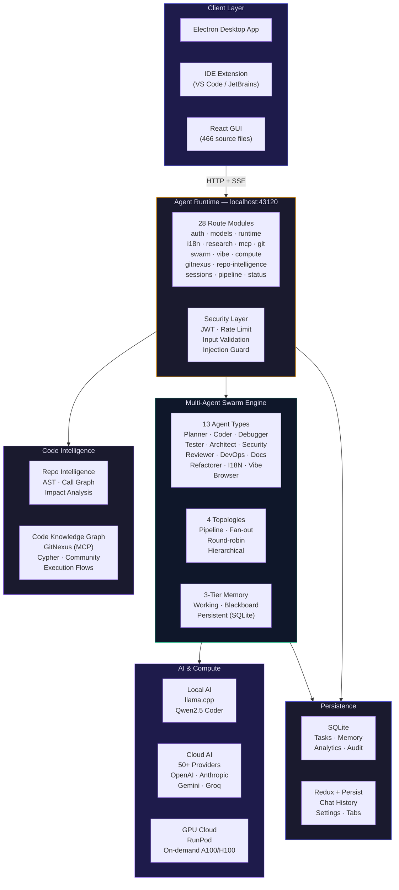
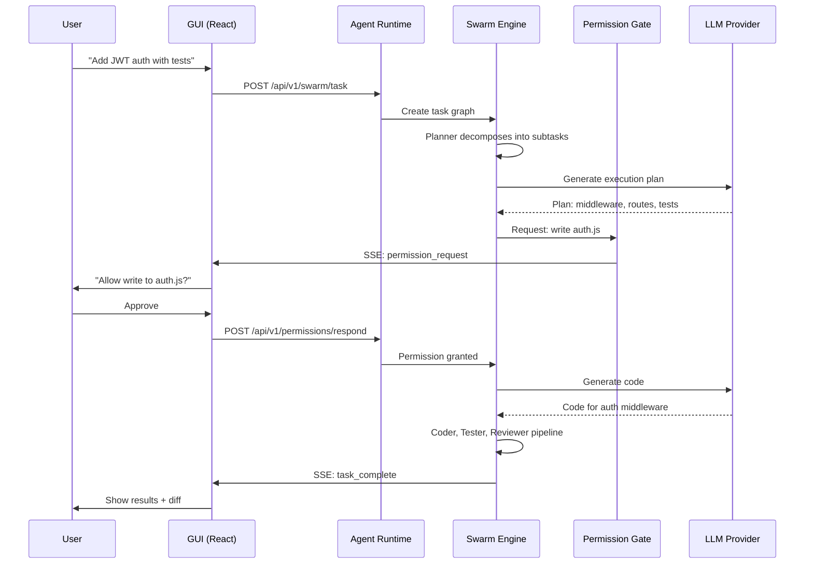
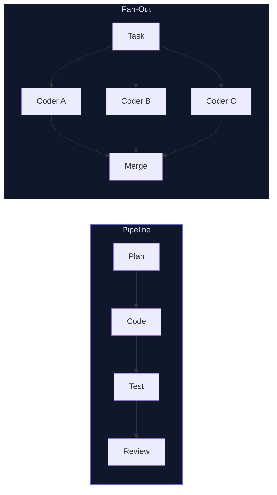
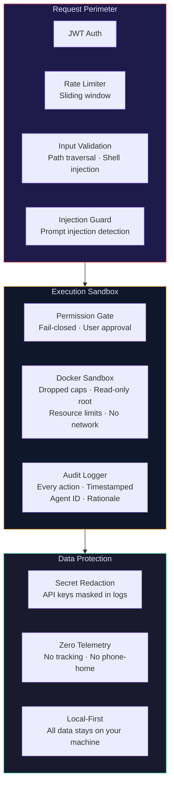

<div align="center">

<br/>


<br/><br/>

<!-- Animated Typing SVG -->
<a href="https://github.com/inbharat-ai/codein.pro">

</a>

<br/><br/>

<!-- Primary Badges -->

[](https://github.com/inbharat-ai/codein.pro/releases)
[](packages/agent/test/)
[](LICENSE)
[](CONTRIBUTING.md)

<br/>

<!-- Tech Stack Badges -->


<br/>

[**Get Started**](#-quick-start) · [**Features**](#-every-feature-in-detail) · [**Architecture**](#%EF%B8%8F-system-architecture) · [**Multi-Agent Swarm**](#-multi-agent-swarm-engine) · [**Skills**](#-skills--automation) · [**Contributing**](#-contributing)

</div>

<br/>


<br/>

## What is CodeIn?

**CodeIn** is an open-source AI code editor with **13 autonomous agents**, **50+ LLM providers**, and **built-in support for 19 languages** — 12 Indian scripts (Hindi, Tamil, Bengali, Telugu, Kannada, Malayalam, and more) plus Spanish, French, German, Chinese, Japanese, and Korean. Runs locally. **Your code never leaves your machine.**

<div align="center">

> _"Your code, your language, your machine."_

</div>

CodeIn is a **complete AI engineering system**, not a wrapper around a single LLM call. 13 specialized agents plan, code, test, and review together. 50+ LLM providers you swap with your own API keys. Local-first inference via llama.cpp that works fully offline. A code knowledge graph that maps your entire codebase before making a single edit.

Write your prompt in any language you think in. Say _"login page bana do with Google auth"_ in Hinglish. Type in Tamil, Bengali, Marathi, or any of 12 Indian scripts — CodeIn detects the script via Unicode analysis, preserves your technical terms, and translates to structured English for AI execution. The language system is open and extensible — add support for any language by contributing to `language-config.js`.

No cloud dependency. No telemetry. No subscription. Apache 2.0, forever free.

<br/>


<br/>

## At a Glance

<div align="center">

<table>
<tr>
<td align="center"><h3>13</h3><b>Agent Types</b></td>
<td align="center"><h3>2,429</h3><b>Tests Passing</b></td>
<td align="center"><h3>50+</h3><b>LLM Providers</b></td>
<td align="center"><h3>19</h3><b>Languages</b></td>
<td align="center"><h3>28</h3><b>Route Modules</b></td>
<td align="center"><h3>$0</h3><b>Forever Free</b></td>
</tr>
</table>

</div>

<br/>


<br/>

## CodeIn vs. Paid Tools

<div align="center">

| Feature                               |   **CodeIn**   | Cursor ($20/mo) | Copilot ($10/mo) | Windsurf ($15/mo) |
| :------------------------------------ | :------------: | :-------------: | :--------------: | :---------------: |
| AI Code Completion                    |    **Yes**     |       Yes       |       Yes        |        Yes        |
| AI Chat & Agent Mode                  |    **Yes**     |       Yes       |       Yes        |        Yes        |
| **Multi-Agent Swarm (13 agents)**     |    **Yes**     |       No        |        No        |        No         |
| **Code Knowledge Graph (GitNexus)**   |    **Yes**     |       No        |        No        |        No         |
| **19 Languages + Voice (12 Indian)**  |    **Yes**     |       No        |        No        |        No         |
| **GPU on Demand (RunPod)**            |    **Yes**     |       No        |        No        |        No         |
| **Autonomous Computer Use**           |    **Yes**     |       No        |        No        |        No         |
| **Web Research Agent**                |    **Yes**     |       No        |        No        |        No         |
| **Background Agent Execution**        |    **Yes**     |       No        |        No        |        No         |
| **100% Free & Open Source**           |    **Yes**     |       No        |        No        |        No         |
| **Local AI via llama.cpp**            |    **Yes**     |       No        |        No        |        No         |
| **50+ LLM Providers (BYO key)**       |    **Yes**     |        ~        |        No        |         ~         |
| **19-Language Unicode Detection**     |    **Yes**     |       No        |        No        |        No         |
| **Docker Sandbox Execution**          |    **Yes**     |       No        |        No        |        No         |
| **Autonomous Plan-Execute-Test Loop** |    **Yes**     |       No        |        No        |        No         |
| MCP Tool Protocol                     |      Yes       |       Yes       |        ~         |        Yes        |
| Zero Telemetry                        |    **Yes**     |       No        |        No        |        No         |
| **Price**                             | **$0 forever** |     $20/mo      |      $10/mo      |      $15/mo       |

</div>

<br/>


<br/>

## Every Feature in Detail

<details open>
<summary><b>Click to expand/collapse</b></summary>

<br/>

### Core AI Engine

| Feature                    | Description                                                                                                                                                                       |
| :------------------------- | :-------------------------------------------------------------------------------------------------------------------------------------------------------------------------------- |
| **Multi-Agent Swarm**      | 13 specialized agent types working in concert. 4 topologies (pipeline, fan-out, round-robin, hierarchical). Circuit breakers, 3-tier blackboard memory, audit logging.            |
| **AI Hub (50+ providers)** | OpenAI, Anthropic, Gemini, Groq, Mistral, Deepseek, Ollama, Azure, Bedrock, Together, Fireworks, OpenRouter, and more. Real-time health monitoring, model browser, cost tracking. |
| **Local AI (llama.cpp)**   | Fully offline inference with automatic model download. Qwen2.5 Coder 1.5B included as default. No cloud dependency required.                                                      |
| **Hybrid Intelligence**    | Classify prompt complexity, route to optimal provider, verify output, escalate if needed. Confidence scoring and automatic fallback chains.                                       |
| **Code Knowledge Graph**   | GitNexus integration for Cypher-queryable code graphs — impact analysis, execution flow tracing, community clustering, and hybrid BM25+semantic search.                           |
| **Vibe Coding Mode**       | Image-to-UI pipeline: upload a screenshot or describe intent in natural language — CodeIn generates a UI spec, scaffolds the project, and writes production code autonomously.    |
| **Autonomous Planner**     | Plan — Execute — Test — Diagnose — Revise — Retry loop with configurable retry limits and cost caps.                                                                              |

### Autonomous Execution

| Feature                        | Description                                                                                                                                                 |
| :----------------------------- | :---------------------------------------------------------------------------------------------------------------------------------------------------------- |
| **Computer Use**               | Goal-based autonomous execution — describe what you want done, CodeIn executes multi-step workflows with skill discovery, templates, and full audit trails. |
| **Background Agent Execution** | Run agents in the background on independent tasks. Monitor progress, cancel, and review results without blocking the main chat.                             |
| **Web Research**               | Agents autonomously search the web, fetch documentation, find bug solutions, and pull code examples — with response caching and permission management.      |
| **Workflow Engine**            | Define reusable multi-step workflows. Chain agent operations into repeatable automation with conditional logic and error recovery.                          |

### Development Tools

| Feature                       | Description                                                                                                                                   |
| :---------------------------- | :-------------------------------------------------------------------------------------------------------------------------------------------- |
| **Docker Sandbox**            | Secure code execution with dropped capabilities, read-only root filesystem, resource limits (CPU, memory, disk), network isolation.           |
| **Git Workflow Automation**   | Branching, commits, diffs, staging, and PR creation — all orchestrated by the swarm agent with human approval gates.                          |
| **Terminal Manager**          | Agent-controlled terminal sessions with timeout protection, history recording, and cross-platform shell support (bash, zsh, PowerShell, cmd). |
| **Repo Intelligence**         | AST-backed symbol finding, call graph analysis, change impact analysis, semantic search, and safe multi-file refactoring.                     |
| **Project Runtime Detection** | Auto-detect project type (Node, Python, Go, Rust, etc.), find run/build commands, manage preview processes with live reload.                  |
| **Pipeline Panel**            | Visual CI/CD-style pipeline view for multi-step agent workflows.                                                                              |

### GPU & Cloud Compute

| Feature                         | Description                                                                                                                                                                         |
| :------------------------------ | :---------------------------------------------------------------------------------------------------------------------------------------------------------------------------------- |
| **GPU on Demand (RunPod)**      | Full RunPod integration: browse GPUs with live pricing, spin up on-demand pods (A100, H100, RTX 4090), submit serverless inference jobs.                                            |
| **9 RunPod MCP Tools**          | `runpod_connect`, `runpod_list_gpus`, `runpod_list_pods`, `runpod_create_pod`, `runpod_stop_pod`, `runpod_terminate_pod`, `runpod_pod_info`, `runpod_run_job`, `runpod_job_status`. |
| **Intelligent Compute Routing** | Complexity classifier routes tasks automatically: local (simple) — swarm (medium) — GPU cloud (complex). Overridable with user preference.                                          |
| **Budget Enforcement**          | Per-session budget cap ($100 default), TTL timer (auto-stop 30 min), idle shutdown (10 min), per-minute cost tracking with SSE alerts.                                              |
| **GPU Session Manager**         | Multi-user session isolation, encrypted API key storage via OS keyring, state persistence across restarts.                                                                          |

### MCP Tool Protocol

| Feature                    | Description                                                                                                                         |
| :------------------------- | :---------------------------------------------------------------------------------------------------------------------------------- |
| **MCP Client Manager**     | Connect to any MCP server (stdio or HTTP). Spawn child processes, negotiate protocol, discover tools, call with full audit logging. |
| **Server Lifecycle**       | Add, connect, disconnect, remove MCP servers. Configuration persisted in `~/.codin/mcp/servers.json`.                               |
| **Tool Discovery & Call**  | Automatically discover tools from connected servers. Execute with argument validation and JSON-RPC 2.0 protocol compliance.         |
| **Audit Trail**            | Every MCP tool call logged to `~/.codin/logs/mcp_tool_calls.jsonl` with timestamp, server, tool name, arguments, and result.        |
| **Built-in RunPod Server** | Pre-built MCP server for RunPod GPU operations — no external setup required. 9 tools for full pod and job lifecycle management.     |

### Intelligence & Localization

| Feature                      | Description                                                                                                                                                                                                                      |
| :--------------------------- | :------------------------------------------------------------------------------------------------------------------------------------------------------------------------------------------------------------------------------- |
| **19 Languages (12 Indian)** | Unicode script analysis: Hindi, Bengali, Tamil, Telugu, Marathi, Gujarati, Kannada, Malayalam, Punjabi, Assamese, Odia, Urdu — plus Spanish, French, German, Chinese, Japanese, and Korean. Extensible via `language-config.js`. |
| **Code-Mixed Input**         | Hinglish, Benglish, Tanglish, and more — normalized to structured English for AI execution while preserving technical terms.                                                                                                     |
| **Voice Input**              | Speech-to-text with AI4Bharat models. Speak your prompt in any supported language.                                                                                                                                               |
| **Text-to-Speech**           | Hear AI responses spoken back in supported languages.                                                                                                                                                                            |

### UI/UX & Editor

| Feature                         | Description                                                                                                           |
| :------------------------------ | :-------------------------------------------------------------------------------------------------------------------- |
| **Monaco Editor**               | Full VS Code editor experience with syntax highlighting, IntelliSense, minimap, multi-cursor, and keybinding support. |
| **Dark + Light + System Theme** | Professional themes with 50+ CSS custom properties. System follows OS preference. Seamless toggle in Settings.        |
| **Chat History Persistence**    | Conversations survive restart via redux-persist. Automatic pruning and session isolation.                             |
| **Session Management**          | Persistent agent sessions across restarts. Multi-user session isolation with state recovery.                          |
| **Auto-Update**                 | Electron auto-updater checks for new releases on launch. Download and install with one click.                         |
| **Conversation Starters**       | AI-suggested prompts to help new users get started. Context-aware based on detected project type.                     |
| **Onboarding Flow**             | Guided first-run experience with mode selection and feature discovery.                                                |
| **TipTap Rich Input**           | Rich text input with @mentions, slash commands, code blocks, and file attachments.                                    |
| **Feedback System**             | Thumbs up/down on every AI response for continuous quality improvement.                                               |

### Compute & Infrastructure

| Feature                     | Description                                                                                                       |
| :-------------------------- | :---------------------------------------------------------------------------------------------------------------- |
| **Compute Orchestrator**    | Full job lifecycle: submit, plan, execute, output. State machine transitions, artifact management, SSE streaming. |
| **SSE Real-Time Streaming** | Server-Sent Events for all agent actions, permission requests, task progress, and compute status.                 |
| **SQLite Persistence**      | Task queue, memory store, analytics — with graceful fallback to in-memory when SQLite unavailable.                |
| **Performance Monitoring**  | Cache stats, HTTP pool metrics, memory usage, and system health — accessible via status endpoints.                |
| **API Versioning**          | `/api/v1/` prefix on all endpoints with backward-compatible normalization for legacy paths.                       |

### Security & Privacy

| Feature                     | Description                                                                              |
| :-------------------------- | :--------------------------------------------------------------------------------------- |
| **Fail-Closed Permissions** | Every destructive operation requires explicit user approval. No silent actions ever.     |
| **JWT Authentication**      | Token-based auth with configurable secrets. Dev mode available for local use.            |
| **Prompt Injection Guard**  | Pattern matching + structural heuristics to detect and block injection attempts.         |
| **Input Validation**        | Shell metacharacter blocking, path traversal prevention, printable ASCII enforcement.    |
| **Audit Logging**           | Every agent action logged with timestamp, agent ID, action type, and decision rationale. |
| **Rate Limiting**           | Sliding-window per-key rate limiter on all public endpoints.                             |
| **Secret Redaction**        | API keys automatically masked in logs, error messages, and SSE streams.                  |
| **Zero Telemetry**          | No tracking, no analytics, no phone-home. 100% private by default.                       |

### Plugin & Extensibility

| Feature               | Description                                                                                          |
| :-------------------- | :--------------------------------------------------------------------------------------------------- |
| **Plugin System**     | Hook-based plugin architecture with timeout protection, priority ordering, and lifecycle management. |
| **Remote Plugins**    | Remote plugin protocol with heartbeat monitoring and automatic reconnection.                         |
| **VS Code Extension** | Full integration with VS Code and JetBrains IDEs via the extension adapter.                          |
| **MCP Integration**   | Connect any MCP-compatible server — register, connect, discover tools, call with audit logging.      |
| **API Contracts**     | Formal contract definitions for all 28 route endpoints. Enables frontend/backend contract stability. |

</details>

<br/>


<br/>

## System Architecture


```mermaid
graph TB
    subgraph Clients["Client Layer"]
        direction LR
        EL["Electron Desktop App"]
        EXT["IDE Extension<br/>(VS Code / JetBrains)"]
        GUI["React GUI<br/>(466 source files)"]
    end

    subgraph Agent["Agent Runtime — localhost:43120"]
        direction LR
        ROUTES["28 Route Modules<br/>auth · models · runtime<br/>i18n · research · mcp · git<br/>swarm · vibe · compute<br/>gitnexus · repo-intelligence<br/>sessions · pipeline · status"]
        SEC["Security Layer<br/>JWT · Rate Limit<br/>Input Validation<br/>Injection Guard"]
    end

    subgraph MAS["Multi-Agent Swarm Engine"]
        direction LR
        AGENTS["13 Agent Types<br/>Planner · Coder · Debugger<br/>Tester · Architect · Security<br/>Reviewer · DevOps · Docs<br/>Refactorer · I18N · Vibe<br/>Browser"]
        TOPO["4 Topologies<br/>Pipeline · Fan-out<br/>Round-robin<br/>Hierarchical"]
        MEM["3-Tier Memory<br/>Working · Blackboard<br/>Persistent (SQLite)"]
    end

    subgraph Intelligence["Code Intelligence"]
        direction LR
        REPO["Repo Intelligence<br/>AST · Call Graph<br/>Impact Analysis"]
        GRAPH["Code Knowledge Graph<br/>GitNexus (MCP)<br/>Cypher · Community<br/>Execution Flows"]
    end

    subgraph Infra["AI & Compute"]
        direction LR
        LOCAL["Local AI<br/>llama.cpp<br/>Qwen2.5 Coder"]
        CLOUD["Cloud AI<br/>50+ Providers<br/>OpenAI · Anthropic<br/>Gemini · Groq"]
        GPU["GPU Cloud<br/>RunPod<br/>On-demand A100/H100"]
    end

    subgraph Store["Persistence"]
        direction LR
        SQLITE["SQLite<br/>Tasks · Memory<br/>Analytics · Audit"]
        REDUX["Redux + Persist<br/>Chat History<br/>Settings · Tabs"]
    end

    Clients -->|"HTTP + SSE"| Agent
    Agent --> MAS
    Agent --> Intelligence
    MAS --> Infra
    MAS --> Store
    Agent --> Store

    style Clients fill:#1e1b4b,stroke:#6366f1,color:#e0def4
    style Agent fill:#1a1a2e,stroke:#f59e0b,color:#e0def4
    style MAS fill:#0f172a,stroke:#10b981,color:#e0def4
    style Intelligence fill:#1a1a2e,stroke:#8b5cf6,color:#e0def4
    style Infra fill:#1e1b4b,stroke:#8b5cf6,color:#e0def4
    style Store fill:#1a1a2e,stroke:#6366f1,color:#e0def4
```

### Data Flow — How a User Request Becomes Action


```mermaid
sequenceDiagram
    participant U as User
    participant G as GUI (React)
    participant A as Agent Runtime
    participant S as Swarm Engine
    participant P as Permission Gate
    participant AI as LLM Provider

    U->>G: "Add JWT auth with tests"
    G->>A: POST /api/v1/swarm/task
    A->>S: Create task graph
    S->>S: Planner decomposes into subtasks
    S->>AI: Generate execution plan
    AI-->>S: Plan: middleware, routes, tests
    S->>P: Request: write auth.js
    P->>G: SSE: permission_request
    G->>U: "Allow write to auth.js?"
    U->>G: Approve
    G->>A: POST /api/v1/permissions/respond
    A->>S: Permission granted
    S->>AI: Generate code
    AI-->>S: Code for auth middleware
    S->>S: Coder, Tester, Reviewer pipeline
    S->>G: SSE: task_complete
    G->>U: Show results + diff
```

### Component Architecture — GUI


```mermaid
graph LR
    subgraph App["App Shell"]
        Router["React Router<br/>7 routes"]
        Theme["Theme Provider<br/>Dark · Light · System"]
        Redux["Redux Store<br/>9 slices · persist"]
    end

    subgraph Panels["Feature Panels"]
        Chat["Chat<br/>History · Streaming<br/>Tool calls · Markdown"]
        Swarm["Swarm Dashboard<br/>Agent status · Topology<br/>Task graph · Metrics"]
        Compute["Compute Panel<br/>Job submission<br/>SSE · Artifacts"]
        GPU["GPU Panel<br/>RunPod · Pods<br/>Browse · Create · Monitor"]
        Computer["Computer Use<br/>Goal execution<br/>Skills · Workflows"]
        Git["Git Panel<br/>Status · Diff<br/>Branch · Commit"]
        AI["AI Hub<br/>Providers · Models<br/>Health · Config"]
        Graph["Code Graph<br/>GitNexus · Index<br/>Query · Impact"]
        MCP["MCP Tools<br/>Servers · Tools<br/>Audit log"]
        Voice["Media Panel<br/>STT · TTS<br/>19 languages"]
    end

    subgraph Editor["Editor"]
        Monaco["Monaco Editor<br/>Syntax · IntelliSense"]
        Terminal["xterm.js Terminal<br/>Multi-session"]
        TipTap["TipTap Input<br/>@mentions · /commands"]
    end

    App --> Panels
    App --> Editor

    style App fill:#1e1b4b,stroke:#6366f1,color:#e0def4
    style Panels fill:#0f172a,stroke:#f59e0b,color:#e0def4
    style Editor fill:#1a1a2e,stroke:#10b981,color:#e0def4
```

<br/>


<br/>

## Multi-Agent Swarm Engine

CodeIn's MAS (Multi-Agent Swarm) is the core orchestration engine. It coordinates **specialized agents** working together on complex tasks — not just a wrapper around a single LLM call.

### How It Works

```
User: "Add JWT auth to this Express API with tests"

  Planner Agent     -> Breaks into subtasks: middleware, routes, tests
  Architect Agent   -> Designs auth flow, picks dependencies
  Coder Agent       -> Implements middleware + route guards
  Tester Agent      -> Writes and runs test suite
  Reviewer Agent    -> Reviews code quality, flags issues
  Security Agent    -> Audits for OWASP vulnerabilities

  All coordinated through pipeline topology with shared blackboard memory.
```

### 13 Agent Types

| Agent          | Role                 | Specialization                                       |
| :------------- | :------------------- | :--------------------------------------------------- |
| `PLANNER`      | Task decomposition   | Breaks complex requests into DAG of subtasks         |
| `CODER`        | Code generation      | Writes, modifies, and refactors code across files    |
| `DEBUGGER`     | Bug diagnosis        | Analyzes stack traces, reproduces, and fixes bugs    |
| `TESTER`       | Test creation        | Generates unit/integration/e2e tests with assertions |
| `REFACTORER`   | Code improvement     | Identifies code smells, applies design patterns      |
| `ARCHITECT`    | System design        | Designs architecture, evaluates trade-offs           |
| `DEVOPS`       | Infrastructure       | Dockerfiles, CI/CD, deployment configs               |
| `SECURITY`     | Security audit       | OWASP scanning, vulnerability detection, hardening   |
| `DOCS`         | Documentation        | Generates API docs, READMEs, inline comments         |
| `REVIEWER`     | Code review          | Quality gates, style enforcement, best practices     |
| `I18N`         | Internationalization | Translation, locale support, RTL handling            |
| `VIBE_BUILDER` | Full-feature builder | Natural language to complete feature implementation  |
| `BROWSER`      | Web research         | LLM-simulated web interaction and research           |

### 4 Orchestration Topologies


```mermaid
graph LR
    subgraph Pipeline["Pipeline"]
        P1[Plan] --> P2[Code] --> P3[Test] --> P4[Review]
    end

    subgraph Fanout["Fan-Out"]
        F0[Task] --> F1[Coder A]
        F0 --> F2[Coder B]
        F0 --> F3[Coder C]
        F1 & F2 & F3 --> F4[Merge]
    end

    style Pipeline fill:#0f172a,stroke:#6366f1,color:#e0def4
    style Fanout fill:#0f172a,stroke:#10b981,color:#e0def4
```

| Topology         | Use Case             | How It Works                                                             |
| :--------------- | :------------------- | :----------------------------------------------------------------------- |
| **Pipeline**     | Sequential workflows | Agent chain: plan, code, test, review. Each stage feeds the next.        |
| **Fan-out**      | Parallel execution   | Multiple agents work simultaneously on independent subtasks, then merge. |
| **Round-robin**  | Load balancing       | Tasks distributed evenly across available agents of the same type.       |
| **Hierarchical** | Complex projects     | Manager agent delegates to specialist sub-agents, aggregates results.    |

### Safety & Control

- **Circuit Breakers** — Agents that fail repeatedly are automatically suspended (LLM timeout + 5s buffer)
- **Permission Gate** — Every destructive action requires explicit user approval via SSE
- **Budget Caps** — Per-task and per-session cost limits prevent runaway spending
- **Audit Trail** — Every agent action logged with timestamp, decision rationale, and cost
- **Permission Isolation** — `approve_always` grants are scoped to a single task, cleared on task completion

<br/>


<br/>

## Code Knowledge Graph

CodeIn integrates with [GitNexus](https://github.com/abhigyanpatwari/GitNexus) as an optional external MCP server for deep code intelligence:

| Capability         | Description                                                             |
| :----------------- | :---------------------------------------------------------------------- |
| **query**          | Hybrid BM25+semantic search, returns ranked execution flows             |
| **context**        | 360-degree view of any symbol — callers, callees, process participation |
| **impact**         | Blast radius analysis with depth grouping (d=1 WILL BREAK, d=2 LIKELY)  |
| **detect_changes** | Git diff mapped to affected symbols and execution flows                 |
| **rename**         | Graph-guided multi-file coordinated rename with confidence tagging      |
| **cypher**         | Raw Cypher queries against the code knowledge graph                     |

Setup via **Settings > Code Graph** or the agent API:

```bash
# Check status
curl http://127.0.0.1:43120/api/v1/gitnexus/status

# Full setup: install check, index, register MCP server
curl -X POST http://127.0.0.1:43120/api/v1/gitnexus/setup
```

GitNexus runs as a separate process (PolyForm Noncommercial license) — CodeIn communicates via the MCP protocol. All existing features work unchanged without it.

<br/>


<br/>

## Code in Every Language of Bharat

Most AI coding tools only understand English. **CodeIn understands you** — whether you think in Hindi, dream in Tamil, or mix Bengali with Python keywords.

<div align="center">

> Type in your mother tongue. CodeIn detects your language via Unicode script analysis,
> preserves your technical terms, and translates to structured English for AI execution.
> **No configuration. No language packs. It just works.**

</div>

### Code-Mixed Input — Write How You Think

| What you type                             | What CodeIn understands                             |
| :---------------------------------------- | :-------------------------------------------------- |
| **"login page bana do with Google auth"** | "Create a login page with Google OAuth integration" |
| **"is repo ka backend improve karo"**     | "Improve the backend of this repository"            |
| **"dashboard ko aur clean banao"**        | "Clean up and improve the dashboard UI"             |
| **"testing likh do is function ke liye"** | "Write tests for this function"                     |
| **"இந்த bug-ஐ fix பண்ணு"**                | "Fix this bug" (Tanglish — Tamil + English)         |
| **"এই API তে error handling add করো"**    | "Add error handling to this API" (Benglish)         |

### 18 Languages — Every Script, Every State

<div align="center">

| Language | Script     |     | Language  | Script     |     | Language | Script   |
| :------- | :--------- | --- | :-------- | :--------- | --- | :------- | :------- |
| Hindi    | Devanagari |     | Bengali   | Bengali    |     | Tamil    | Tamil    |
| Telugu   | Telugu     |     | Marathi   | Devanagari |     | Gujarati | Gujarati |
| Kannada  | Kannada    |     | Malayalam | Malayalam  |     | Punjabi  | Gurmukhi |
| Assamese | Assamese   |     | Odia      | Odia       |     | Urdu     | Nastaliq |
| Sindhi   | Arabic     |     | Konkani   | Devanagari |     | Manipuri | Meitei   |
| Dogri    | Devanagari |     | Bodo      | Devanagari |     | Santali  | Ol Chiki |

Plus code-mixed patterns: **Hinglish** · **Benglish** · **Tanglish** and more.

</div>

### Voice Input — Speak Your Code

Speech-to-text with AI4Bharat models. Say your prompt in Hindi, Tamil, or any supported language — CodeIn transcribes, detects the language, and executes. Text-to-speech reads AI responses back to you.

<br/>


<br/>

## AI Hub — 50+ Providers

<div align="center">

<table>
<tr>
<td align="center">

**Cloud AI**<br/>
OpenAI · Anthropic · Gemini<br/>Groq · Mistral · Deepseek · xAI

</td>
<td align="center">

**Hosted Inference**<br/>
Together · Fireworks · Replicate<br/>SambaNova · Cerebras · OpenRouter

</td>
<td align="center">

**Local / Self-Hosted**<br/>
Ollama · LM Studio · llama.cpp<br/>Llamafile · vLLM · TGI

</td>
<td align="center">

**Enterprise**<br/>
Azure OpenAI · AWS Bedrock<br/>Google VertexAI · Nvidia NIM

</td>
</tr>
</table>

</div>

- Real-time health monitoring with latency tracking
- Automatic model discovery and capability detection
- Cost tracking per agent, per model, per session
- Streaming support for all providers
- Failover chains — if primary provider is down, automatically switch

<br/>


<br/>

## GPU on Demand — RunPod Integration

CodeIn includes a full RunPod integration — browse GPUs, create pods, submit jobs, and track costs, all from the GPU panel or via 9 MCP tools that agents can call autonomously.

| MCP Tool               | What it does                                         |
| :--------------------- | :--------------------------------------------------- |
| `runpod_connect`       | Store your RunPod API key (encrypted via OS keyring) |
| `runpod_list_gpus`     | Browse available GPUs with live pricing              |
| `runpod_create_pod`    | Spin up an on-demand GPU pod (A100, H100, RTX 4090)  |
| `runpod_stop_pod`      | Stop pod (preserves volume for later)                |
| `runpod_terminate_pod` | Destroy pod + volume permanently                     |
| `runpod_pod_info`      | Get pod status, utilization, and cost                |
| `runpod_list_pods`     | List all active pods                                 |
| `runpod_run_job`       | Submit serverless inference jobs (async or sync)     |
| `runpod_job_status`    | Check job completion and retrieve results            |

**Safety:** Budget cap ($100/session default), TTL timer (auto-stop 30 min), idle shutdown (10 min), per-minute cost tracking with real-time SSE alerts. Multi-user session isolation with encrypted API key storage.

**Intelligent Routing:** The compute selector classifies task complexity and automatically routes: local inference (simple) — multi-agent swarm (medium) — GPU cloud (complex). Override with `--prefer local|quality|fast|cost`.

<br/>


<br/>

## Security Model


```mermaid
graph TB
    subgraph Perimeter["Request Perimeter"]
        JWT["JWT Auth"]
        RATE["Rate Limiter<br/>Sliding window"]
        VALID["Input Validation<br/>Path traversal · Shell injection"]
        INJECT["Injection Guard<br/>Prompt injection detection"]
    end

    subgraph Execution["Execution Sandbox"]
        PERM["Permission Gate<br/>Fail-closed · User approval"]
        DOCKER["Docker Sandbox<br/>Dropped caps · Read-only root<br/>Resource limits · No network"]
        AUDIT["Audit Logger<br/>Every action · Timestamped<br/>Agent ID · Rationale"]
    end

    subgraph Data["Data Protection"]
        REDACT["Secret Redaction<br/>API keys masked in logs"]
        ZERO["Zero Telemetry<br/>No tracking · No phone-home"]
        LOCAL["Local-First<br/>All data stays on your machine"]
    end

    Perimeter --> Execution --> Data

    style Perimeter fill:#1e1b4b,stroke:#ef4444,color:#e0def4
    style Execution fill:#0f172a,stroke:#f59e0b,color:#e0def4
    style Data fill:#1a1a2e,stroke:#10b981,color:#e0def4
```

<br/>


<br/>

## Quick Start

> **Prerequisites:** Node.js 20.19+ · npm 10+

### 1. Clone & Install

```bash
git clone https://github.com/inbharat-ai/codein.pro.git
cd CodeIn
npm install
```

### 2. Start the Agent Runtime

```bash
cd packages/agent
npm start
```

```
  CodeIn Agent listening on http://127.0.0.1:43120
  All subsystems loaded
```

### 3. Start the GUI

```bash
cd gui
npm run dev
```

### 4. Or Launch the Desktop App

```bash
cd electron-app
npm run dev
```

### 5. Verify

```bash
curl http://127.0.0.1:43120/api/v1/health
# { "status": "ok", "uptime": 42, ... }
```

### Choose Your Interface

| Interface         | Path                                         | Description                              |
| :---------------- | :------------------------------------------- | :--------------------------------------- |
| **Desktop App**   | [`electron-app/`](electron-app/)             | Standalone Electron app with auto-update |
| **IDE Extension** | [`packages/extension/`](packages/extension/) | VS Code / JetBrains integration          |
| **Web GUI**       | [`gui/`](gui/)                               | React development UI with all panels     |
| **Landing Page**  | [`landing/`](landing/)                       | Public website                           |

<br/>


<br/>

## Repository Structure

<details>
<summary><b>Full monorepo layout (click to expand)</b></summary>

<br/>

```
CodeIn/
│
├── packages/agent/                 # Core agent runtime (Node.js)
│   ├── src/
│   │   ├── index.js                #   HTTP server (28 route modules, API v1)
│   │   ├── subsystem-loader.js     #   Optional subsystem loading (fail-safe)
│   │   ├── mas/                    #   Multi-Agent Swarm engine
│   │   │   ├── swarm-manager.js    #     Orchestrator (4 topologies, lifecycle)
│   │   │   ├── swarm-execution.js  #     Task execution with retry + permission
│   │   │   ├── agents/             #     13 agent implementations
│   │   │   │   └── base-agent.js   #       Base class (circuit breaker, memory)
│   │   │   ├── memory.js           #     3-tier blackboard memory
│   │   │   ├── permissions.js      #     Fail-closed permission gate
│   │   │   ├── autonomous-planner.js    # Plan-execute-test loop
│   │   │   ├── docker-sandbox.js        # Secure container execution
│   │   │   ├── git-workflow.js          # Git automation
│   │   │   ├── terminal-manager.js      # Agent-controlled terminals
│   │   │   ├── sqlite-store.js          # Persistent storage
│   │   │   ├── plugin-system.js         # Hook-based plugins
│   │   │   └── audit-trail.js           # Action audit logging
│   │   ├── routes/                 #   28 HTTP route modules
│   │   │   ├── registry.js         #     Dependency-injected route registration
│   │   │   ├── auth.js             #     JWT authentication
│   │   │   ├── swarm.js            #     Swarm task submission
│   │   │   ├── compute.js          #     Compute routing
│   │   │   ├── mcp.js              #     MCP server management
│   │   │   ├── gitnexus.js         #     Code graph integration
│   │   │   ├── repo-intelligence.js#     AST-backed code analysis
│   │   │   └── ...                 #     21 more route modules
│   │   ├── gitnexus/               #   GitNexus MCP integration service
│   │   │   └── service.js          #     Install, index, staleness, MCP registration
│   │   ├── mcp/                    #   MCP client manager
│   │   │   ├── client-manager.js   #     Server lifecycle, tool registry, audit
│   │   │   └── runpod-mcp-server.js#     9-tool RunPod MCP server (570 lines)
│   │   ├── gpu-orchestration/      #   RunPod GPU provider (579 lines)
│   │   │   └── runpod-provider.js  #     GraphQL API, pod lifecycle, budget
│   │   ├── compute/                #   Compute orchestration
│   │   │   ├── orchestrator.js     #     Job lifecycle + multilingual output
│   │   │   └── gpu-session-manager.js #  Session isolation + keyring storage
│   │   ├── routing/                #   Intelligent compute routing
│   │   │   └── compute-selector.js #     Complexity → local/swarm/GPU routing
│   │   ├── research/               #   Web research service
│   │   ├── ai-hub/                 #   Multi-provider AI management
│   │   ├── repo-intelligence/      #   Code analysis engine
│   │   ├── intelligence/           #   Hybrid intelligence orchestrator
│   │   └── security/               #   Sandbox, validators, rate limiter
│   └── test/                       #   193 test suites, 1,788 tests
│
├── gui/                            # React 18 + Redux Toolkit + Vite 6
│   ├── src/
│   │   ├── components/             #   466 source files
│   │   │   ├── SwarmPanel/         #     Swarm dashboard
│   │   │   ├── AIHubPanel/         #     AI provider management
│   │   │   ├── ComputePanel/       #     Compute jobs (4 sub-components)
│   │   │   ├── GpuPanel/           #     RunPod GPU (8 files: connect, types,
│   │   │   │                       #       pods, create, session hook, API)
│   │   │   ├── ComputerPanel/      #     Autonomous execution (run, skills,
│   │   │   │                       #       workflows, audit)
│   │   │   ├── MediaPanel/         #     Voice STT/TTS + media
│   │   │   ├── BackgroundMode/     #     Background agent execution
│   │   │   ├── ConversationStarters/ #   AI-suggested prompts
│   │   │   ├── OnboardingCard/     #     First-run guidance
│   │   │   └── ui/                 #     Reusable: EmptyState, Toast, etc.
│   │   ├── hooks/                  #   Custom hooks (useTheme, etc.)
│   │   ├── redux/                  #   9 slices + persist
│   │   ├── pages/
│   │   │   ├── gui/                #   Chat (decomposed: Header, MessageList,
│   │   │   │                       #     Footer, useSendInput)
│   │   │   └── config/             #   Settings: Models, Rules, Tools, MCP,
│   │   │                           #     Code Graph, Git, Deploy, Indexing
│   │   └── styles/                 #   CSS themes (dark + light)
│   └── src/**/*.test.tsx           #   68 test files, 641 tests
│
├── electron-app/                   # Electron 28 desktop shell
│   ├── src/main/
│   │   ├── main.ts                 #   App lifecycle + service init
│   │   ├── WindowManager.ts        #   Window creation + management
│   │   └── services/               #   10 backend services
│   │       ├── AgentService.ts     #     Agent runtime bridge (port 43120)
│   │       ├── AutoUpdateService.ts     # electron-updater integration
│   │       ├── FileSystemService.ts     # File operations
│   │       ├── GitService.ts            # Git operations
│   │       ├── TerminalService.ts       # PTY terminals
│   │       ├── ModelManagerService.ts   # Local model management
│   │       ├── MediaService.ts          # STT/TTS
│   │       └── ...                      # 3 more services
│   └── src/preload/                #   Secure IPC bridge
│
├── core/                           # Shared TypeScript types & utilities
│   ├── tools/                      #   Tool system (definitions, policies)
│   ├── indexing/                   #   CodebaseIndexer, LanceDB, FTS
│   ├── autocomplete/               #   Autocomplete engine
│   ├── context/                    #   Context assembly
│   └── protocol/                   #   IPC protocol definitions
│
├── packages/extension/             # VS Code / JetBrains adapter
├── landing/                        # Public website
│
├── ARCHITECTURE.md                 # Detailed technical architecture
├── CONTRIBUTING.md
├── SECURITY.md
├── LICENSE                         # Apache 2.0
└── CLAUDE.md                       # AI assistant instructions
```

</details>

<br/>


<br/>

## Testing

### Test Suite Summary

| Package          | Runner                   |  Suites |     Tests | Status          |
| :--------------- | :----------------------- | ------: | --------: | :-------------- |
| `packages/agent` | Node.js test runner      |     193 |     1,788 | All passing     |
| `gui`            | Vitest + Testing Library |      68 |       641 | All passing     |
| **Total**        |                          | **261** | **2,429** | **All passing** |

### Run Tests

```bash
# Agent runtime tests (193 suites, 1,788 tests)
cd packages/agent && npm test

# GUI component + integration tests (68 files, 641 tests)
cd gui && npx vitest run

# TypeScript type check (zero errors)
cd gui && npx tsc --noEmit

# Production build
cd gui && npm run build
```

**Coverage areas:** Swarm orchestration, agent lifecycle, circuit breakers, permission isolation, HTTP routes, security validators, SQLite persistence, AI Hub adapters, plugin system, terminal management, GitNexus integration, Redux state, React components, streaming, tool calls, error boundaries, empty/loading states.

<br/>


<br/>

## Theme System

CodeIn supports three theme modes with 50+ CSS custom properties:

| Mode               | Description                                                                                  |
| :----------------- | :------------------------------------------------------------------------------------------- |
| **Dark** (default) | Deep indigo palette with warm accents. Easy on eyes for long coding sessions.                |
| **Light**          | Clean white/gray palette with deeper accent colors for readability. WCAG AA contrast ratios. |
| **System**         | Automatically follows your OS dark/light preference via `prefers-color-scheme`.              |

Toggle in **Settings > Appearance > Theme** or programmatically via the `useTheme()` hook.

<br/>


<br/>

## Skills & Automation

CodeIn ships with two categories of built-in skills that extend agent capabilities beyond raw LLM calls.

### Agent Runtime Skills (12)

Registered in the plugin system (`plugin-system.js`), these skills are available to all agents and can be invoked programmatically or through the swarm engine.

| Skill                     | Description                                                 |
| :------------------------ | :---------------------------------------------------------- |
| `generate-commit-message` | LLM-enhanced conventional commit messages from staged diffs |
| `generate-pr-description` | PR summaries generated from diff content and commit history |
| `analyze-code`            | Code analysis with actionable improvement suggestions       |
| `lint-check`              | Code linting analysis and style enforcement                 |
| `detect-secrets`          | Scan for hardcoded secrets, API keys, and credentials       |
| `estimate-complexity`     | Cyclomatic complexity estimation for functions and modules  |
| `generate-docs`           | Documentation generation from source code                   |
| `generate-test-file`      | Test file scaffolding with framework-appropriate structure  |
| `search-codebase`         | Semantic code search across the workspace                   |
| `explain-code`            | Code explanation for onboarding and knowledge transfer      |
| `suggest-refactor`        | Refactoring suggestions with pattern-based recommendations  |
| `review-security`         | Security vulnerability scanning (OWASP-aligned)             |

Skills run inside the plugin sandbox with timeout protection (30s default), no network access, and no writes outside the workspace.

### Claude Code IDE Skills (11)

Located in `.claude/skills/`, these provide domain-specific guidance when using Claude Code as the AI backend within the IDE.

| Skill                   | Category          | Description                                                        |
| :---------------------- | :---------------- | :----------------------------------------------------------------- |
| `code-reviewer`         | Quality           | Comprehensive code review for React/TypeScript/Node.js             |
| `debug-helper`          | Debugging         | Systematic debugging methodology from reproduction to fix          |
| `refactor-assistant`    | Refactoring       | Safe, incremental refactoring with test-first workflow             |
| `security-auditor`      | Security          | OWASP-aligned security audit for Node.js/React/Electron            |
| `api-designer`          | Architecture      | REST API design covering resources, errors, pagination, versioning |
| `test-architect`        | Testing           | Testing strategy and patterns for Vitest/Jest + RTL                |
| `performance-optimizer` | Performance       | React, Node.js, and Electron performance optimization              |
| `git-workflow`          | Workflow          | Branching, conventional commits, PR best practices                 |
| `react-component`       | Frontend          | React component design patterns with TypeScript and accessibility  |
| `mcp-builder`           | AI Infrastructure | Build MCP servers with transports, tools, resources, and security  |
| `docs-style`            | Documentation     | Style guidelines for writing and reviewing documentation           |

<br/>


<br/>

## Contributing

<div align="center">

**We welcome contributions!** Bug fixes, new features, new language support, documentation improvements.

</div>

1. **Fork** the repository
2. **Branch** — `git checkout -b feature/amazing-feature`
3. **Commit** — `git commit -m 'Add amazing feature'`
4. **Push** — `git push origin feature/amazing-feature`
5. **Open** a Pull Request

See [`CONTRIBUTING.md`](CONTRIBUTING.md) and [`DEVELOPMENT.md`](DEVELOPMENT.md) for conventions and setup guides.

<br/>


<br/>

## License

Apache 2.0 — see [`LICENSE`](LICENSE) for details.

<br/>

---

<div align="center">

<br/>


<br/>

**Built by [AIS Developers](https://github.com/AIS-Developers)**

_Open-source AI coding for everyone — in every language_

Contact: [info@inbharat.ai](mailto:info@inbharat.ai)

<br/>

[](https://github.com/inbharat-ai/codein.pro)

<br/>


<sub>If CodeIn helps you, give it a star!</sub>

</div>


