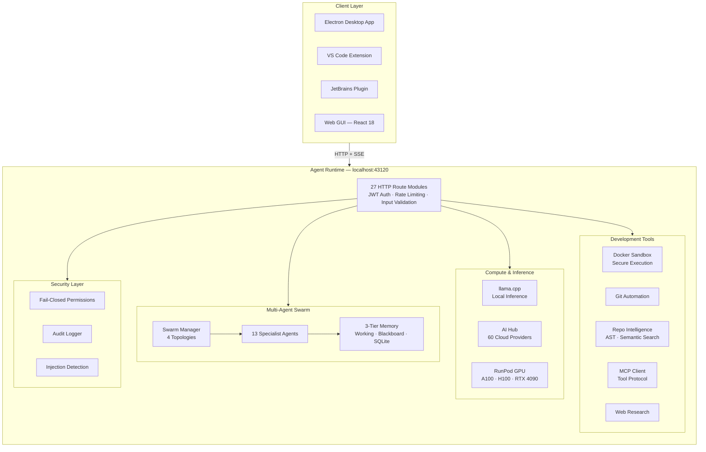

<div align="center">

<br/>


<br/><br/>

# CodeIn

**Open-source AI coding IDE — local-first, multilingual, multi-agent**

<br/>

[](LICENSE)
[](https://github.com/inbharat-ai/codein.pro/releases)
[](https://nodejs.org)
[](https://github.com/inbharat-ai/codein.pro)
[](CONTRIBUTING.md)

<br/>

[**Quick Start**](#-getting-started) &middot; [**Features**](#-core-capabilities) &middot; [**Languages**](#-language-support) &middot; [**Agents**](#-multi-agent-swarm) &middot; [**Architecture**](#-architecture) &middot; [**Contributing**](#-contributing)

<br/>

</div>

---

## What is CodeIn?

CodeIn is an open-source AI coding IDE built as an Electron desktop application, VS Code extension, JetBrains plugin, and standalone web GUI — all sharing a single local agent runtime.

At its core: a **Node.js HTTP server on `localhost:43120`** orchestrating 60 LLM provider integrations, a 13-agent autonomous swarm, Docker-sandboxed code execution, and voice-enabled prompting in 22 Indian languages. Everything runs on your machine. No cloud account required. No telemetry. Apache 2.0.

The project is at **v1.0.2-beta** — the architecture is complete and the core feature set works end-to-end, with ongoing polish and stabilization before v1.0 stable.

---

## Why CodeIn?

| The problem                                             | What CodeIn does instead                                                            |
| :------------------------------------------------------ | :---------------------------------------------------------------------------------- |
| Most AI coding tools require a paid subscription        | Apache 2.0 — free to use, fork, and self-host forever                               |
| Cloud-only tools send your code to remote servers       | Local-first: llama.cpp runs inference fully offline, on your hardware               |
| Provider lock-in (Copilot = OpenAI, Cursor = Anthropic) | 60 provider integrations — swap with your own API key, or go fully local            |
| English-only prompting                                  | 22 Indian languages + code-mixed input (Hinglish, Benglish, Tanglish) + voice       |
| Single-agent, single-turn chat                          | 13-agent autonomous swarm with planning, execution, testing, review, and retry      |
| No visibility into agent actions                        | Fail-closed permissions, audit logging, explicit approval gates for destructive ops |

---

## Core Capabilities

### AI Engine

| Feature                         | Description                                                                                                                                                                              |     Status     |
| :------------------------------ | :--------------------------------------------------------------------------------------------------------------------------------------------------------------------------------------- | :------------: |
| **60+ LLM Providers**           | OpenAI, Anthropic, Gemini, Groq, Mistral, Deepseek, Ollama, Azure, Bedrock, Together, Fireworks, OpenRouter, and 48 more. Per-request cost tracking, health monitoring, failover chains. |       ✅       |
| **Local Inference (llama.cpp)** | Fully offline inference. Qwen2.5 Coder 1.5B ships as default. No cloud dependency required to run the IDE.                                                                               |       ✅       |
| **Multi-Agent Swarm**           | 13 specialist agents with 4 orchestration topologies. Circuit breakers, 3-tier blackboard memory, SQLite persistence, audit logging.                                                     |       ✅       |
| **MCP Tool Protocol**           | Connect any MCP server (stdio or HTTP). Tool discovery, argument validation, JSON-RPC 2.0, audit trail.                                                                                  |       ✅       |
| **Autonomous Planner**          | Plan → Execute → Test → Diagnose → Revise → Retry loop with configurable retry limits and cost caps.                                                                                     |       ✅       |
| **Code Knowledge Graph**        | GitNexus integration for AST-backed symbol resolution, call graph tracing, and hybrid BM25+semantic search.                                                                              | 🔄 In progress |
| **Vibe Coding**                 | Upload a screenshot or describe UI intent — CodeIn generates a spec and writes production code autonomously.                                                                             | 🔄 In progress |

### Development Tools

| Feature               | Description                                                                                                              |     Status     |
| :-------------------- | :----------------------------------------------------------------------------------------------------------------------- | :------------: |
| **Repo Intelligence** | AST symbol finding, change impact analysis, semantic search, safe multi-file refactoring.                                |       ✅       |
| **Git Automation**    | Branching, commits, diffs, staging, PR creation — agent-orchestrated with human approval gates.                          |       ✅       |
| **Docker Sandbox**    | Secure agent code execution: dropped capabilities, read-only root, resource limits, network isolation.                   |       ✅       |
| **Web Research**      | Agents search the web, fetch documentation, cache responses, and synthesize results autonomously.                        |       ✅       |
| **Background Agents** | Run agents on independent tasks in the background; monitor progress without blocking the main chat.                      |       ✅       |
| **GPU on Demand**     | RunPod integration: browse GPUs, spin up pods (A100, H100, RTX 4090), submit serverless inference jobs with budget caps. |       ✅       |
| **Computer Use**      | Goal-based screen automation with skill templates and audit trails. Vision pipeline for UI interaction.                  | 🔄 In progress |
| **Terminal Manager**  | Agent-controlled terminal sessions with timeout protection and cross-platform shell support.                             |       ✅       |

### Editor and UI

| Feature               | Description                                                                                                                | Status |
| :-------------------- | :------------------------------------------------------------------------------------------------------------------------- | :----: |
| **Monaco Editor**     | Full VS Code editor experience: syntax highlighting, IntelliSense, minimap, multi-cursor.                                  |   ✅   |
| **TipTap Rich Input** | Rich text input with @mentions, slash commands, code blocks, and file attachments.                                         |   ✅   |
| **xterm.js Terminal** | Integrated terminal emulator with PTY support.                                                                             |   ✅   |
| **Voice Input + TTS** | Browser speech-to-text for dictation in 22 Indian languages. Backend TTS via gTTS / Azure with browser synthesis fallback. |   ✅   |
| **Theme Support**     | Dark and light themes with 50+ CSS custom properties. Follows OS preference.                                               |   ✅   |
| **Plugin System**     | Hook-based plugin architecture with timeout protection, priority ordering, and lifecycle management.                       |   ✅   |

---

## Multi-Agent Swarm

CodeIn ships a production-ready multi-agent system. Agents run as isolated tasks, communicate through a shared blackboard, and are coordinated by a swarm manager that enforces permission gates and budget limits.

**13 specialist agent types:**

| Agent              | Role                                                            |
| :----------------- | :-------------------------------------------------------------- |
| `PlannerAgent`     | Task decomposition, dependency graphing, orchestration planning |
| `CoderAgent`       | Code generation and implementation                              |
| `ReviewerAgent`    | Code review and quality analysis                                |
| `TesterAgent`      | Test case generation and execution                              |
| `RefactorerAgent`  | Code refactoring and technical debt reduction                   |
| `DebuggerAgent`    | Bug diagnosis, root cause analysis, and patching                |
| `SecurityAgent`    | OWASP-aligned vulnerability scanning                            |
| `DocsAgent`        | Documentation generation from source                            |
| `ArchitectAgent`   | Architecture and system design guidance                         |
| `DevOpsAgent`      | CI/CD, Docker, and deployment orchestration                     |
| `BrowserAgent`     | Autonomous web research and documentation retrieval             |
| `I18nAgent`        | Language detection, code-mixed input normalization, translation |
| `VibeBuilderAgent` | UI generation from images and natural language descriptions     |

**4 orchestration topologies:**

```
Pipeline         Fan-Out          Round-Robin      Hierarchical
────────         ───────          ───────────      ────────────
A → B → C        A → B            A → B → A        Orchestrator
                 A → C            A → C → A          ├── Team A
                 A → D                               └── Team B
```

**Memory architecture:** Working memory (per-task) → Blackboard (cross-agent) → SQLite persistence (`~/.codein/swarm/codein.db`)

---

## Language Support

Most AI coding tools only understand English. CodeIn accepts prompts in 22 Indian languages, detects the script automatically, and translates to structured English for AI execution — so you can write the way you think.

### Tier 1 — Full Support (11 languages)

UI translation · Voice input · Script detection · Text-to-speech

| Language  | Code | Script     |
| :-------- | :--- | :--------- |
| Hindi     | `hi` | Devanagari |
| Bengali   | `bn` | Bengali    |
| Telugu    | `te` | Telugu     |
| Marathi   | `mr` | Devanagari |
| Tamil     | `ta` | Tamil      |
| Gujarati  | `gu` | Gujarati   |
| Kannada   | `kn` | Kannada    |
| Malayalam | `ml` | Malayalam  |
| Punjabi   | `pa` | Gurmukhi   |
| Odia      | `or` | Odia       |
| Assamese  | `as` | Assamese   |

### Tier 2 — Core Support (11 languages)

UI translation · Voice input _(script detection expanding)_

| Language | Code  | Script     | Notes                              |
| :------- | :---- | :--------- | :--------------------------------- |
| Urdu     | `ur`  | Nastaliq   | Script detection not yet available |
| Sindhi   | `sd`  | Arabic     | Script detection not yet available |
| Konkani  | `kok` | Devanagari | Shares Devanagari detection        |
| Manipuri | `mni` | Meitei     | Script detection not yet available |
| Dogri    | `doi` | Devanagari | Shares Devanagari detection        |
| Bodo     | `brx` | Devanagari | Shares Devanagari detection        |
| Santali  | `sat` | Ol Chiki   | Script detection not yet available |
| Maithili | `mai` | Devanagari | Shares Devanagari detection        |
| Nepali   | `ne`  | Devanagari | Shares Devanagari detection        |
| Sanskrit | `sa`  | Devanagari | Shares Devanagari detection        |
| Kashmiri | `ks`  | Nastaliq   | Script detection not yet available |

### Code-Mixed Input

Write how you think. CodeIn handles natural code-mixed patterns:

| What you type                           | What CodeIn understands                           |
| :-------------------------------------- | :------------------------------------------------ |
| _"login page bana do with Google auth"_ | Create a login page with Google OAuth integration |
| _"is repo ka backend improve karo"_     | Improve the backend of this repository            |
| _"testing likh do is function ke liye"_ | Write tests for this function                     |

---

## LLM Providers

60 provider integrations ship in `core/llm/llms/`. Swap providers at runtime without restarting the agent.

<details>
<summary><strong>View all 60 providers</strong></summary>

**Major cloud providers**
OpenAI · Anthropic · Google Gemini · Azure OpenAI · AWS Bedrock · AWS SageMaker · Google Vertex AI · Mistral · Groq

**Secondary cloud providers**
Together · Fireworks · OpenRouter · Deepseek · Cohere · Cerebras · Nvidia NIM · IBM WatsonX · SambaNova · Replicate · HuggingFace Inference API

**Local / self-hosted**
Ollama · llama.cpp · LlamaFile · LlamaStack · LM Studio · Text Gen Web UI · vLLM · Docker (containerized)

**Embedding providers**
Voyage · HuggingFace TEI · HuggingFace TGI · TransformersJS (WASM)

**Regional and specialized**
Moonshot · Novita · SiliconFlow · OVHcloud · Scaleway · Cloudflare · Inception · Kindo · AskSage · Nous · Venice · Mimo · NCompass · FunctionNetwork · Nebius · Lemonade · Msty · CometAPI · TARS · Flowise · Relace

**Custom**
`CustomLLM` — bring any OpenAI-compatible endpoint

</details>

---

## Skills and Automation

CodeIn ships two categories of built-in skills that extend agent capabilities beyond raw LLM calls.

### Agent Runtime Skills (12)

Registered in the plugin system; available to all agents. Sandboxed with a 30-second execution timeout.

| Skill                     | Description                                                 |
| :------------------------ | :---------------------------------------------------------- |
| `generate-commit-message` | LLM-enhanced conventional commit messages from staged diffs |
| `generate-pr-description` | PR summaries from diff content and commit history           |
| `analyze-code`            | Code analysis with actionable improvement suggestions       |
| `lint-check`              | Code linting analysis and style enforcement                 |
| `detect-secrets`          | Scan for hardcoded secrets, API keys, and credentials       |
| `estimate-complexity`     | Cyclomatic complexity estimation for functions and modules  |
| `generate-docs`           | Documentation generation from source code                   |
| `generate-test-file`      | Test file scaffolding with framework-appropriate structure  |
| `search-codebase`         | Semantic code search across the workspace                   |
| `explain-code`            | Code explanation for onboarding and knowledge transfer      |
| `suggest-refactor`        | Refactoring suggestions with pattern-based recommendations  |
| `review-security`         | Security vulnerability scanning (OWASP-aligned)             |

### Claude Code IDE Skills (11)

Located in `.claude/skills/` — domain-specific guidance when using Claude Code as the AI backend.

| Skill                   | Description                                                        |
| :---------------------- | :----------------------------------------------------------------- |
| `code-reviewer`         | Comprehensive code review for React / TypeScript / Node.js         |
| `debug-helper`          | Systematic debugging from reproduction to verified fix             |
| `refactor-assistant`    | Safe, incremental refactoring with test-first workflow             |
| `security-auditor`      | OWASP-aligned audit for Node.js / React / Electron                 |
| `api-designer`          | REST API design covering resources, errors, pagination, versioning |
| `test-architect`        | Testing strategy and patterns for Vitest / Jest + RTL              |
| `performance-optimizer` | React, Node.js, and Electron performance optimization              |
| `git-workflow`          | Branching, conventional commits, PR best practices                 |
| `react-component`       | React component design patterns with TypeScript and accessibility  |
| `mcp-builder`           | Build MCP servers with transports, tools, resources, and security  |
| `docs-style`            | Style guidelines for writing and reviewing documentation           |

---

## Architecture

### System Overview


```mermaid
graph TB
    subgraph Clients["Client Layer"]
        E[Electron Desktop App]
        V[VS Code Extension]
        J[JetBrains Plugin]
        W[Web GUI — React 18]
    end

    subgraph Runtime["Agent Runtime — localhost:43120"]
        direction TB
        API[27 HTTP Route Modules<br/>JWT Auth · Rate Limiting · Input Validation]

        subgraph MAS["Multi-Agent Swarm"]
            SM[Swarm Manager<br/>4 Topologies]
            AG[13 Specialist Agents]
            MEM[3-Tier Memory<br/>Working · Blackboard · SQLite]
            SM --> AG
            AG --> MEM
        end

        subgraph Compute["Compute & Inference"]
            LC[llama.cpp<br/>Local Inference]
            HUB[AI Hub<br/>60 Cloud Providers]
            GPU[RunPod GPU<br/>A100 · H100 · RTX 4090]
        end

        subgraph Tools["Development Tools"]
            SBX[Docker Sandbox<br/>Secure Execution]
            GIT[Git Automation]
            RI[Repo Intelligence<br/>AST · Semantic Search]
            MCP[MCP Client<br/>Tool Protocol]
            WEB[Web Research]
        end

        subgraph Security["Security Layer"]
            PERM[Fail-Closed Permissions]
            AUD[Audit Logger]
            INJ[Injection Detection]
        end

        API --> MAS
        API --> Compute
        API --> Tools
        API --> Security
    end

    Clients -->|HTTP + SSE| Runtime
```

### Monorepo Structure

```
codein.pro/
├── packages/
│   ├── agent/              # Agent runtime — Node.js HTTP server (port 43120)
│   │   ├── src/
│   │   │   ├── index.js    #   Server bootstrap + 27 route modules
│   │   │   ├── mas/        #   Multi-Agent Swarm (13 agents, 4 topologies)
│   │   │   ├── routes/     #   HTTP route handlers
│   │   │   ├── ai-hub/     #   Multi-provider AI management
│   │   │   ├── mcp/        #   MCP client manager
│   │   │   ├── gpu-orchestration/  # RunPod integration
│   │   │   └── security/   #   Sandbox, validators, rate limiter
│   │   └── test/           #   193 test suites · 1,788 tests
│   │
│   ├── extension/          # VS Code / JetBrains adapter
│   ├── codein-sdk/         # SDK for programmatic agent integration
│   ├── config-yaml/        # YAML configuration parser
│   ├── config-types/       # Shared TypeScript config types
│   ├── compute-local/      # Local compute manager
│   ├── openai-adapters/    # OpenAI SDK adapters
│   └── fetch/              # Custom fetch wrapper with auth
│
├── core/                   # Shared TypeScript library
│   ├── llm/llms/           #   60 LLM provider implementations
│   ├── autocomplete/       #   Code completion engine
│   ├── context/            #   Context provider system
│   └── util/               #   Shared utilities
│
├── gui/                    # React 18 + Redux Toolkit + Vite 6
│   ├── src/
│   │   ├── components/     #   50+ components (panels, editor, terminal)
│   │   ├── pages/          #   Main GUI routes
│   │   ├── redux/          #   State slices (session, swarm, config, ui…)
│   │   └── util/           #   Auth, agent config, helpers
│   └── (68 test files · 641 tests)
│
├── electron-app/           # Electron 28 desktop shell
├── extensions/
│   ├── vscode/             # VS Code extension (40+ commands, 30+ keybindings)
│   ├── intellij/           # JetBrains IDE adapter
│   └── cli/                # Command-line interface
└── landing/                # Public website
```

### Tech Stack

| Layer         | Technology                                                |
| :------------ | :-------------------------------------------------------- |
| Desktop shell | Electron 28.2 with auto-update                            |
| Frontend      | React 18, Redux Toolkit 2.11, Vite 6, Tailwind CSS 3.4    |
| Code editor   | Monaco Editor 4.7                                         |
| Terminal      | xterm.js 5.3 + node-pty                                   |
| Rich input    | TipTap 2.27                                               |
| Agent runtime | Node.js 20.19+, plain `node:http` (no framework)          |
| Persistence   | better-sqlite3                                            |
| Auth          | jsonwebtoken 9.0                                          |
| Logging       | Pino                                                      |
| Platforms     | Windows (NSIS), macOS (DMG/PKG), Linux (AppImage/DEB/RPM) |

---

## Security Model

CodeIn follows a defense-in-depth architecture for locally-run agent execution.

| Layer                          | What it does                                                                                           |
| :----------------------------- | :----------------------------------------------------------------------------------------------------- |
| **Fail-closed permissions**    | Every destructive operation requires explicit user approval before the agent proceeds                  |
| **JWT authentication**         | All agent API requests require a valid token; configurable secret                                      |
| **Prompt injection detection** | Pattern matching and structural heuristics block injected instructions                                 |
| **Input validation**           | Shell metacharacter blocking, path traversal prevention, schema validation                             |
| **Docker sandbox**             | Agent code execution: dropped Linux capabilities, read-only root, CPU/memory limits, network isolation |
| **Audit logging**              | Every agent action logged with timestamp, agent ID, and rationale to `data/audit-logs/`                |
| **Rate limiting**              | Sliding-window per-key rate limiter on all endpoints                                                   |
| **Secret redaction**           | API keys automatically masked in logs and SSE streams                                                  |
| **Zero telemetry**             | No tracking, no analytics, no phone-home of any kind                                                   |

See [`SECURITY.md`](SECURITY.md) for the full model and responsible disclosure policy.

---

## Getting Started

> **Prerequisites:** Node.js 20.19+ and npm 10+

### Install from source

```bash
# Clone the repository
git clone https://github.com/inbharat-ai/codein.pro.git
cd codein.pro
npm install

# Start the agent runtime (keep this running)
cd packages/agent
npm start
# → CodeIn Agent listening on http://127.0.0.1:43120

# In a second terminal — launch the desktop app (recommended)
cd ../..
cd electron-app && npm run dev

# Or launch the web GUI
cd gui && npm run dev
```

### Verify the agent is running

```bash
curl http://127.0.0.1:43120/api/v1/health
# {"status":"ok","uptime":42,...}
```

### Download pre-built binaries

| Platform    | Format                      | Link                                                                  |
| :---------- | :-------------------------- | :-------------------------------------------------------------------- |
| **Windows** | NSIS installer + portable   | [Releases](https://github.com/inbharat-ai/codein.pro/releases/latest) |
| **macOS**   | DMG (Intel + Apple Silicon) | [Releases](https://github.com/inbharat-ai/codein.pro/releases/latest) |
| **Linux**   | AppImage + DEB              | [Releases](https://github.com/inbharat-ai/codein.pro/releases/latest) |

### VS Code Extension

Install the extension from `packages/extension/` or build from source:

```bash
cd packages/extension
npm install && npm run build
# Load the generated .vsix in VS Code via "Install from VSIX"
```

---

## Testing

| Package          | Runner                   |  Suites |     Tests |
| :--------------- | :----------------------- | ------: | --------: |
| `packages/agent` | Node.js test runner      |     193 |     1,788 |
| `gui`            | Vitest + Testing Library |      68 |       641 |
| **Total**        |                          | **261** | **2,429** |

```bash
cd packages/agent && npm test       # Agent runtime tests
cd gui && npx vitest run            # GUI component tests
cd gui && npx tsc --noEmit          # TypeScript type check
```

---

## Project Status

**Version:** v1.0.2-beta &nbsp;|&nbsp; **License:** Apache 2.0 &nbsp;|&nbsp; **Stage:** Public beta

CodeIn's core architecture is complete and the primary feature set — multi-agent swarm, 60 provider integrations, local inference, and 22-language support — works end-to-end. The project is in active development toward v1.0 stable.

**Implemented and working:**

- Multi-agent swarm (13 agents, 4 topologies, SQLite persistence)
- 60 LLM provider integrations with per-request cost tracking
- Local offline inference via llama.cpp
- 22 Indian languages + code-mixed input + voice I/O
- Docker sandboxed code execution
- Git automation with approval gates
- Repo intelligence (AST, semantic search, impact analysis)
- Web research (search, fetch, cache)
- MCP tool protocol (stdio + HTTP)
- RunPod GPU orchestration
- VS Code extension + JetBrains adapter + CLI
- Electron desktop with auto-update
- JWT authentication, rate limiting, audit logging

**In progress:**

- Code Knowledge Graph (GitNexus) — AST-backed graph queries, Cypher interface, execution flow tracing
- Computer Use vision pipeline — advanced screen-state understanding beyond current skill templates
- Vibe Coding Mode — image-to-UI pipeline; intent parsing and spec generation functional, full code generation pipeline maturing

**Known technical debt (being addressed):**

- `packages/agent/src/index.js` is monolithic (~1,100 lines); route modularization in progress
- `gui/src/redux/slices/sessionSlice` is large; normalization planned
- Mixed styling (Tailwind + styled-components + plain CSS); consolidating to Tailwind
- No API versioning on route endpoints yet

---

## Roadmap

| Milestone                         | Target  |     Status     |
| :-------------------------------- | :------ | :------------: |
| v1.0-beta public launch           | Q1 2026 |     🟡 Now     |
| GitNexus code graph GA            | Q2 2026 | 🔄 In progress |
| Computer Use GA                   | Q2 2026 | 🔄 In progress |
| Vibe Coding GA                    | Q2 2026 | 🔄 In progress |
| VS Code Marketplace listing       | Q2 2026 |   📋 Planned   |
| JetBrains Marketplace listing     | Q2 2026 |   📋 Planned   |
| Route API versioning (`/api/v2/`) | Q2 2026 |   📋 Planned   |
| sessionSlice normalization + perf | Q2 2026 |   📋 Planned   |
| v1.0 stable release               | Q3 2026 |   📋 Planned   |

---

## Contributing

Contributions are welcome — bug fixes, new features, LLM provider integrations, language support expansions, documentation improvements, and test coverage.

```bash
# 1. Fork and clone
git clone https://github.com/YOUR_USERNAME/codein.pro.git

# 2. Create a feature branch
git checkout -b feat/your-feature

# 3. Make your changes and commit (conventional commits)
git commit -m 'feat(agent): add support for XYZ provider'

# 4. Push and open a pull request
git push origin feat/your-feature
```

Read [`CONTRIBUTING.md`](CONTRIBUTING.md) for conventions and [`DEVELOPMENT.md`](DEVELOPMENT.md) for the full developer setup guide.

---

## License

[Apache 2.0](LICENSE) — free to use, modify, and distribute, including commercially.

---

## Contact

**Built by [inBharat AI](https://github.com/inbharat-ai)**
&nbsp;·&nbsp; Email: [info@inbharat.ai](mailto:info@inbharat.ai)
&nbsp;·&nbsp; Issues: [github.com/inbharat-ai/codein.pro/issues](https://github.com/inbharat-ai/codein.pro/issues)

---

<div align="center">

<br/>


<br/><br/>

**Your code. Your language. Your machine.**

<br/>

[](https://github.com/inbharat-ai/codein.pro)

<br/>

</div>
